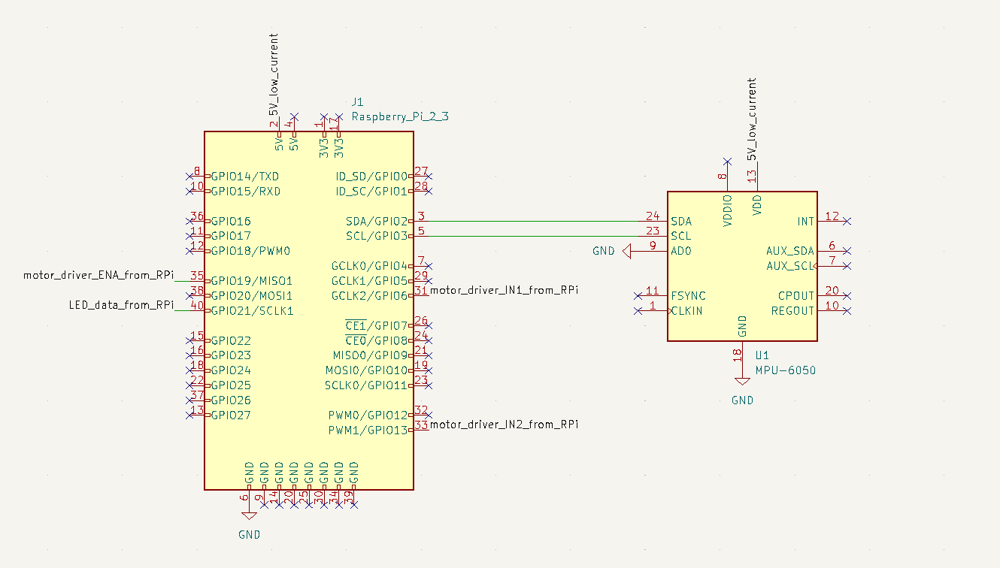
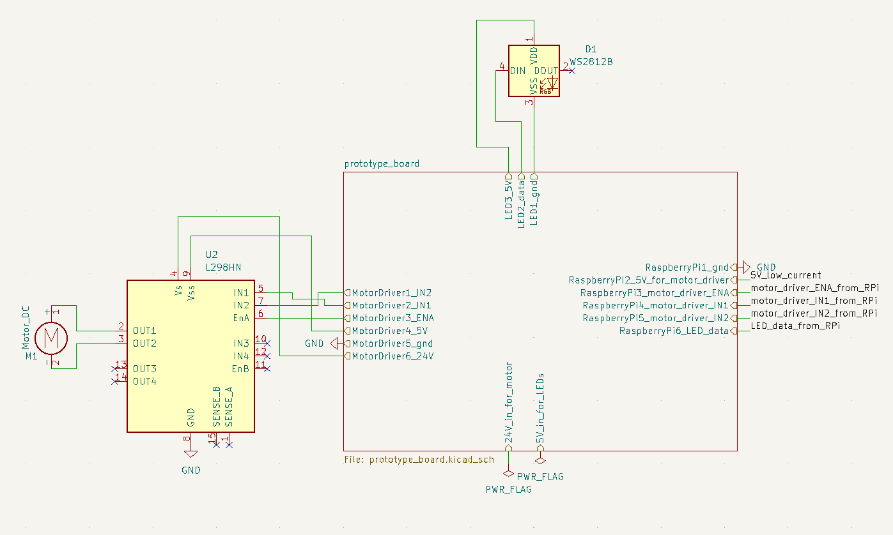
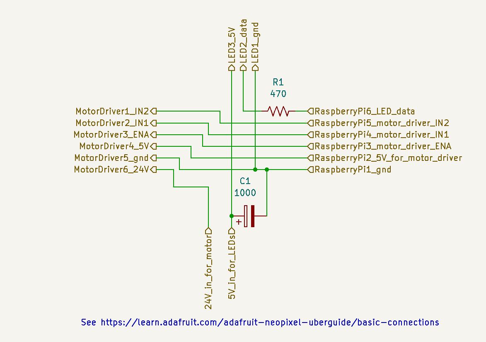

# KiCad schematic for window blinds auto open/close gadget

This KiCad project only contains schematics for documenting the wiring and connections&mdash;there is no PCB. It was made with KiCad version 6.

The root sheet (window_blinds_auto_open_close.kicad_sch) shows connections between Raspberry Pi, accelerometer, motor driver, motor, addressable LEDs, and prototype board.

A nested sheet (prototype_board.kicad_sch) shows what connection are made on the prototype board.

To learn about how to navigate hierarchical sheets, visit https://en.wikibooks.org/wiki/Kicad/eeschema/Hierarchical_Sheets#Navigating_the_hierarchy.

## Screenshots 

