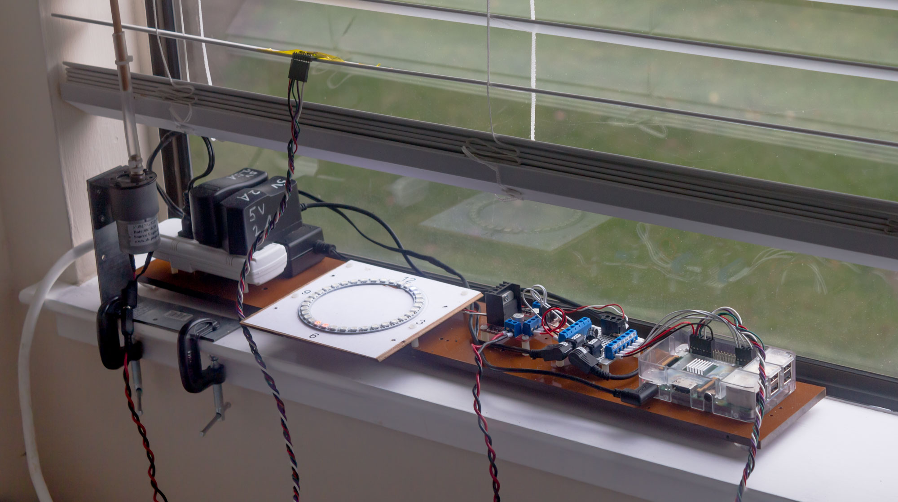
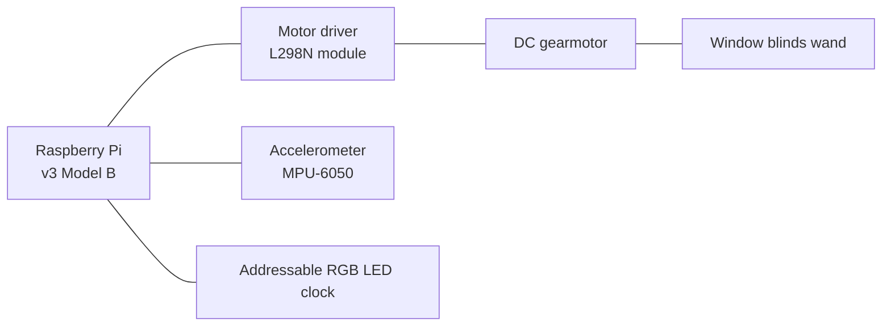

# Window blinds automatic open/close gadget

## Purpose

I want to block harsh reflected sunlight in the early mornings, but I also want daylight to enter my room later in day.

This device automatically closes window blinds before sunrise, then opens the window blinds at a time specified by the user.

## Screenshot

    <!-- use HTML to center the image -->
    

## Window blinds terminology

The parts that rotate to block light by covering the window are called **slats**. 

To make the slats rotate by hand, you rotate a stick called a **wand**.

### Overview

A motor rotates the wand to open and close the blinds. An accelerometer taped to one of the slats provides feedback. A Raspberry Pi keeps track of time, controls the motor, and monitors the accelerometer. The time is displayed on a ring of addressable RGB LEDs.

Details:

* The motor is a Source Engineering Inc 37JB270G/32ZYT30-2468, 24 V DC, 25 RPM, 8 inch-pounds.
* The accelerometer module also contains a gyroscope, which is not used.
* There are three power supplies: 5V for Raspberry Pi, 5V with more current for the addressable RGB LEDs, and 24V for the motor.

Motor mounting:
* Generic gearmotor mounting plate, 31 mm diameter bolt hole circle.
* Simpson Strong-Tie A44 metal angle bracket, 1.5 in wide - it's the perfect size to support the motor mounting plate.
* Two one-inch C-clamps to holds the angle bracket onto the windowsill.
* M3 machine screws & nuts - connects the motor to the mounting plate, and the mounting plate to the angle bracket.

Motor to blinds interface:
* Wooden dowel, 1/4 in diameter - replaces the wand.
* Vinyl tubing, 1/4 in inside diameter - flexible coupling zip-tied to the motor shaft and dowel.

## Led ring clock

I want to see what time the Raspberry Pi thinks it it, and when it will open and close the blinds, without leaving a computer monitor on.

I'm using a generic WS2812B addressable LED (Neopixel) ring, 35 LEDs, 96mm outside diameter.

Here is a prototype I used to work out the logic: https://editor.p5js.org/pfroud/sketches/SYHjqIggA
