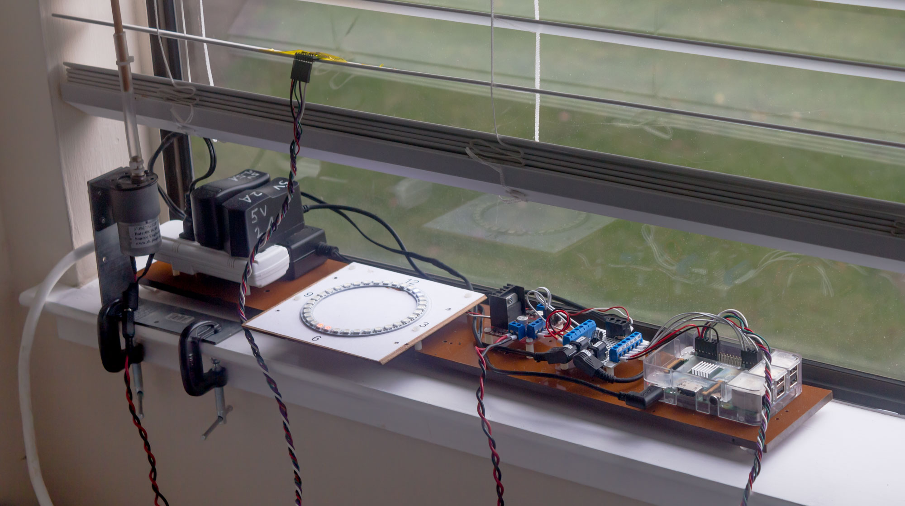
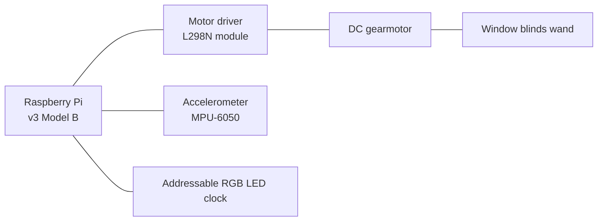
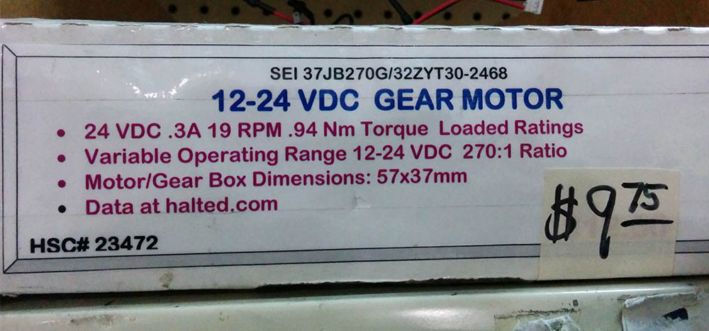
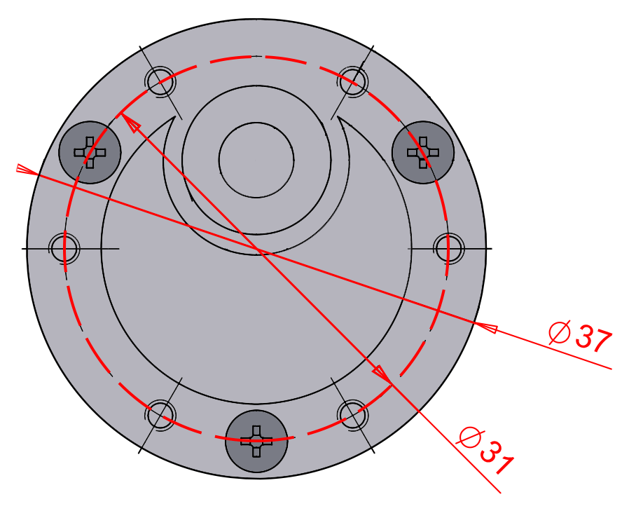
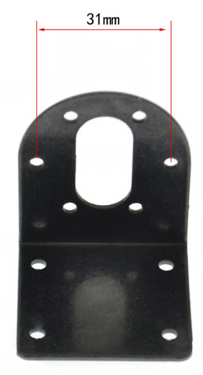
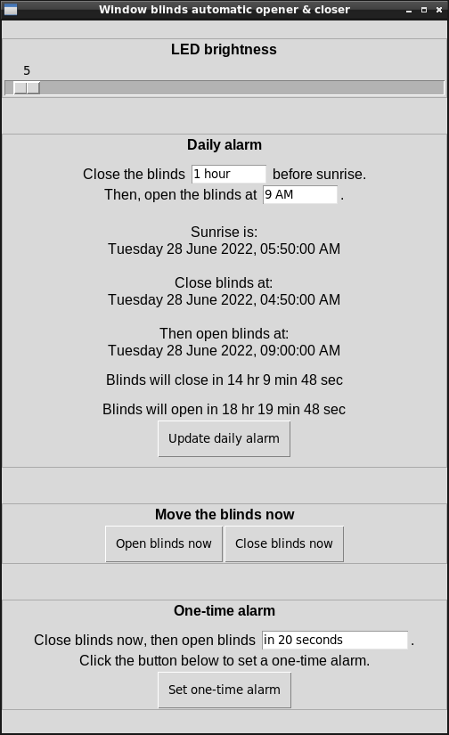

# Window blinds automatic open/close gadget

I want to block harsh reflected sunlight in the early mornings, but I also want daylight to enter my room later in day.

This device automatically closes window blinds before sunrise, then opens the window blinds at a time specified by the user.

## Window blinds terminology

* The opaque white rectangles which block light when they are parallel to the window are called **slats**. 

* To rotate the slats by hand, you rotate a stick called a **wand**.

## Hardware

A motor rotates the wand to open & close the blinds. An accelerometer taped to one of the slats provides feedback. A Raspberry Pi keeps track of time, controls the motor, and monitors the accelerometer. The time is displayed on a ring of addressable RGB LEDs.

<!-- https://mermaid-js.github.io/mermaid/#/flowchart -->

The accelerometer module also contains a gyroscope, which is not used in this project.

There are three power supplies: 5V for the Raspberry Pi, another 5V with more current for the addressable RGB LEDs, and 24V for the motor.

A little prototype board with a bunch of screw terminals helps manage wiring. It also houses a capacitor and resistor as recommended in the [Adafruit NeoPixel Überguide](https://learn.adafruit.com/adafruit-neopixel-uberguide/basic-connections).

For this project I purchased a [DuPont](https://www.mattmillman.com/info/crimpconnectors/dupont-and-dupont-connectors/) crimp tool AND a ferrule crimp tool. Both are a joy to use and made the wiring much nicer.

### Motor

The motor is made by Source Engineering Inc and has this ridiculously long model number:

   > 37JB270G/32ZYT30-2468

I got it at HSC Electronics (rest in peace) in 2018. Here's a picture of the label, which lists some slightly interesting specs:

### Motor mounting plate

The motor has a bolt hole circle which is **31 (thirty-one) millimeters** in diameter.

Surely that's a mistake and it's actually 30 (thirty) mm...  
No, *it really is 31 (thirty-one) mm*.

Amazingly, 31mm is *normal* for this size of gearmotor. The key is that the outside diameter of the gearbox is **37 (thirty-seven) millimeters**. 

Searching for "31mm gearmotor mount" returns a scattering of suitable mounting plates.  
Searching for "37mm gearmotor mount" returns tons of results. 

I had such a hard time figuring this out that I am stealing pictures from the internet, editing them, and re-hosting them in this Git repository:

<table>
<tr>
<td width="67%"></td>
<td></td>
</tr>
</table>

The holes have M3 threads. There are usually five or six of them.

### Other mounting stuff

* A [Simpson Strong-Tie A44](https://www.homedepot.com/p/Simpson-Strong-Tie-4-9-16-in-x-4-3-8-in-x-1-1-2-in-Galvanized-Angle-A44/100375040) angle bracket is the perfect size to support the motor mounting plate.

* Two adorable [one-inch C-clamps](https://www.harborfreight.com/1-inch-c-clamp-37842.html) hold the angle bracket onto the windowsill.

* Some M3 machine screws & nuts hold all the metal parts together.

* A 1/4-inch diameter wooden dowel replaces the original window blinds wand.

* A piece of 1/4-inch inside diameter vinyl tube zip-tied to the motor shaft and dowel acts as a torque-limiting flexible shaft coupler.

### Addressable RGB LED clock

I want to see what time the Raspberry Pi thinks it it, and when it will open/close the blinds, without leaving a computer monitor on.

I'm using a generic WS2812B addressable LED (Neopixel) ring, 35 LEDs, 96mm outside diameter. 

A logic level shifter is theoretically needed because the Raspberry Pi GPIO is 3.3V but the addressable LEDs operate on 5V. For some reason, my setup has always worked fine without a logic level shifter.

Here is a prototype I used to work out the logic: https://editor.p5js.org/pfroud/sketches/SYHjqIggA

## Software

Screenshot of low-quality GUI:

    <!-- use HTML to center the image -->
    

