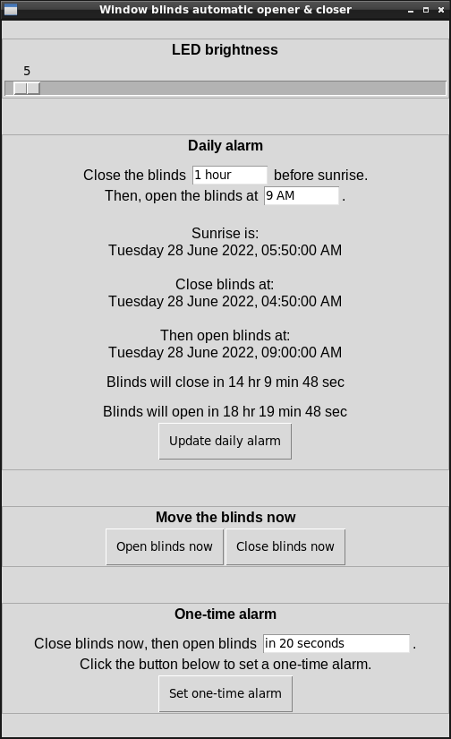

# Window blinds automatic open/close gadget

## Purpose

I want to block harsh reflected sunlight in the early mornings, but I also want daylight to enter my room later in day.

This device automatically closes window blinds before sunrise, then opens the window blinds at a time specified by the user.

## Screenshot

## How it works

### But first, some window blinds terminology

To open and close the blinds by hand, you rotate a stick called a **wand**.

The parts that block light by covering the window are called **slats**. 

### Overview

A motor rotates the wand to open and close the blinds. An accelerometer taped to one of the slats provides feedback. A Raspberry Pi keeps track of time, controls the motor, and monitors the accelerometer.

### List of parts

Important stuff:
* Raspberry Pi 3 Model B.
* Source Engineering Inc 37JB270G/32ZYT30-2468 gearmotor, 24 V DC, 25 RPM, 8 in. lbs. - I already had it, probably way more torque than needed.
* [Cytron MD30C](https://www.cytron.io/p-30amp-5v-30v-dc-motor-driver) motor driver - I already had it, totally overkill.
* Generic MPU6050 accelerometer - also contains a gyroscope which I don't use.
* 24 V power supply for motor - I don't know how much current is needed, I'm using a 100 W one because I already had it.

Motor mounting:
* Generic gearmotor mounting plate, 31 mm diameter bolt hole circle.
* Simpson Strong-Tie A44 metal angle bracket, 1.5 in wide - perfect size to support the motor mounting plate.
* Two one-inch C-clamps - holds the angle bracket on the windowsill.
* M3 machine screws & nuts - connects the motor to the mounting plate, and the mounting plate to the angle bracket.

Motor to blinds interface:
* Wooden dowel, 1/4 in diameter - replaces the wand.
* Vinyl tubing, 1/4 in inside diameter - flexible coupling zip-tied to the motor shaft and dowel.

## Led ring clock

I want to see what time the Raspberry Pi thinks it it, and when it will open and close the blinds, without leaving a monitor on.

I'm using a generic WS2812B addressable LED (Neopixel) ring, 35 LEDs, 96mm outside diameter.

Here is a prototype I used to work out the logic: https://editor.p5js.org/pfroud/sketches/SYHjqIggA

## Project timeline

* 2017 - had the idea, but didn't know how to mount the motor or attach it to the window.
* April 2020 - began ordering parts.
* July 2020 - started looking at Raspberry Pi programming.
